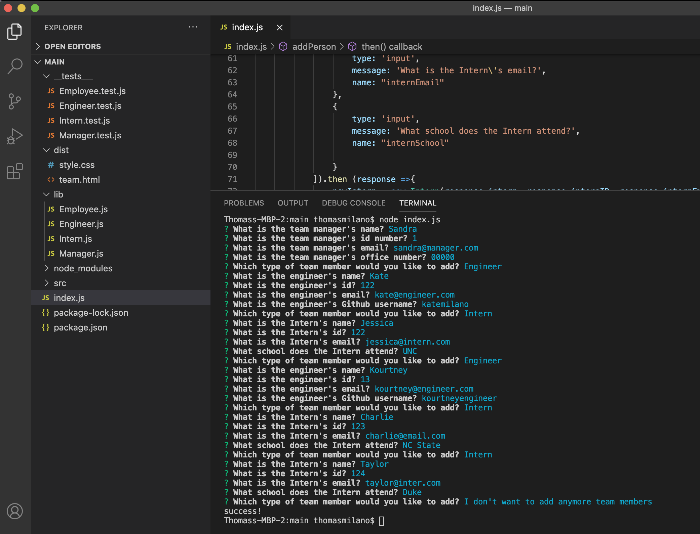
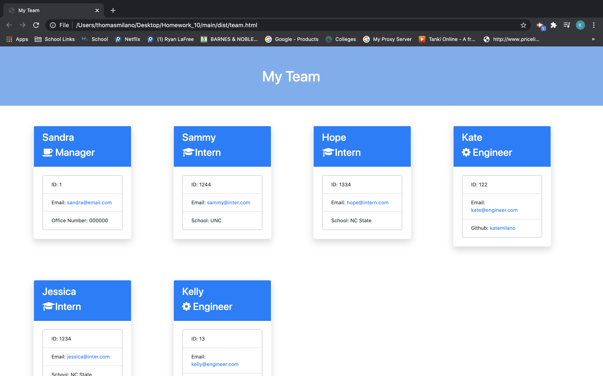

# Team Profile Generator

[](https://opensource.org/licenses/Apache-2.0)

## Description

This application allows you to create a webpage for your work team.  You will be prompted with a series of questions that will allow you to enter in information aboout the manager and the engineers and interns on your team to give you a full webpage display of your team and their information.

## Table of Content

* [Installation](#installation)

* [Photos](#photos)

* [Video](#video)

* [Tests](#tests)

* [License](#license)

* [Contribution](#contribution)

* [Questions](#questions)

## Installation
To install necessary dependencies, run the following command:

```bash
npm i
```

## Photos
Running through the terminal questions


What the webpage will look like


## Video
Step through video demo
https://drive.google.com/file/d/1X1j_ByFM7VRCPjolzLrRigcmHh0NdahG/view?usp=sharing

## Tests

```bash
npm run test
```

## License

This project is licensed under the APACHE 2.0 license.

## Contribution

Thanks to the instructors and teaching assistants at UNC Chapel Hill Bootcamp for making the creation of this webpage possible.

## Questions

If you have any questins about the repo, you can contact me directly at catherine.ann.milano@gmail.com. You can find more of my work at [katemilano](http://github.com/katemilano/).
    

